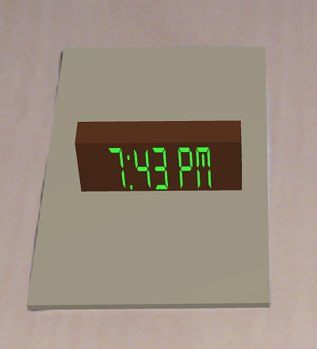

# CS428 Project 1
This is my unfinished project 1. Currently I implemented 4 widgets. You will be able to see current time and date. 
You will aslo be able to see temperature, humidity, wind speed and wind direction for a city of Chicago. All 4 widgets can be present at the same time.

To run the application you have to simply download and import the project into Unity3D. Once you do that go into File->Build Settings... and check your platform.
Once you do that you can build and run application by pressing Build And Run button. The application was written on Unity 2019.4.1f1 version and Vuforia 9.3.3 version.

